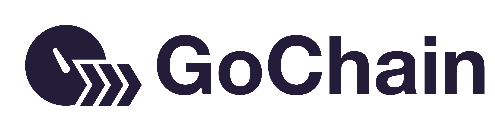

# GoChain Docs

Official GoChain documentation.

## General Information about GoChain

You can find general GoChain information and help on [wiki](https://github.com/gochain/docs/wiki). 

If you have questions or want to discuss something, check out the [discussions section](https://github.com/gochain/docs/discussions). 

## Smart Contract / DApp Developers

If you are developing smart contracts or dapps to deploy to GoChain, you'll find the information you need here.

### Developing on GoChain

Since GoChain is 100% Ethereum compatible, all the Ethereum developer tools will work including web3.js, Truffle Framework, etc. To use those tools, simply point them to a GoChain network, more details on how to do that below.

* [Building, deploying and interacting with contracts using web3 CLI](https://github.com/gochain-io/web3) -- **Recommended**
* [How to deploy OpenZeppelin token contracts super easily](https://medium.com/gochain/the-easiest-way-to-deploy-an-openzeppelin-smart-contract-no-truffle-required-d248d4c3835a)
* [How to deploy to GoChain with Truffle Framework](public-network/truffle/)
* [How to deploy to GoChain using MyEtherWallet](https://medium.com/gochain/how-to-deploy-a-smart-contract-to-gochain-40de78d4d85a)
* [How to deploy to Gochain using Remix](https://medium.com/gochain/how-to-deploy-a-smart-contract-to-gochain-40de78d4d85a)
* [How to deploy to GoChain using Visual Studio Code and the GoChain Wallet](https://medium.com/gochain/how-to-deploy-a-smart-contract-in-5-minutes-bed2443be23c)
* [Learn why GoChain fees are 7500x cheaper than Ethereum](https://medium.com/gochain/gochain-transaction-fees-are-at-least-7500x-less-than-ethereum-3b7060743717)
* [Wrapped GO contract](https://github.com/gochain/wgo)

## Public Network

The GoChain public network is the best performing web3/Ethereum compatible blockchain on the market.

- Higher throughput volumes: 1300 tx/s
- Faster transaction times: 5 second blocks
- Lower fees: >7500x cheaper than Ethereum

Give it a try for yourself to experience the difference.

## Testnet

[Testnet info](https://github.com/gochain/docs/wiki/testnet)

### Network RPC URLs

When interacting with GoChain, the easiest way is to use our hosted JSON-RPC API's. The base URLs
are:

* GoChain TestNet - https://testnet-rpc.gochain.io
* GoChain MainNet - https://rpc.gochain.io

### Running a Public Network Node

[Node Documentation](public-network/nodes/)

### Integrating GoChain into Wallets

[Click here](public-network/README.md) for all the information you'll need for doing these integrations.

## Private Networks

GoChain is highly optimized for private blockchain networks and has been battle tested in the wild for over a year.

[Learn why GoChain is the best option for an Ethereum/web3 compatible private network](https://medium.com/gochain/ethereum-vs-gochain-private-network-showdown-d094096e7d88).

Learn how to [setup your own GoChain network here](private-networks).

## Questions?

Post your questions here: https://github.com/gochain/docs/discussions

