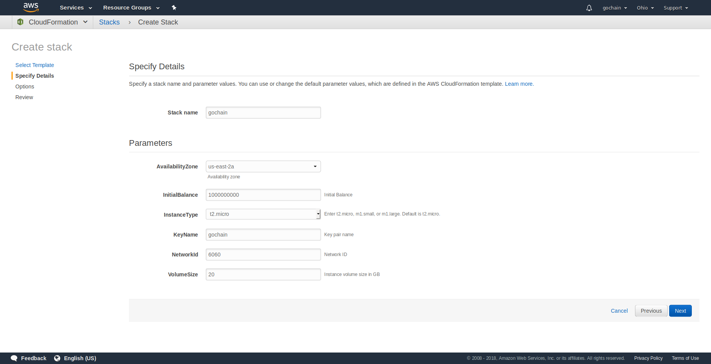

# GoChain - AWS cloudformation templates
The templates that allows you easily launch one node cluster using AWS CloudFormation

# How to use

Just use this [template](gochain-cf-stack.yaml) with [this instruction](https://console.aws.amazon.com/cloudformation/)

# How to test 

[Follow instructions here](TEST.md)
    
